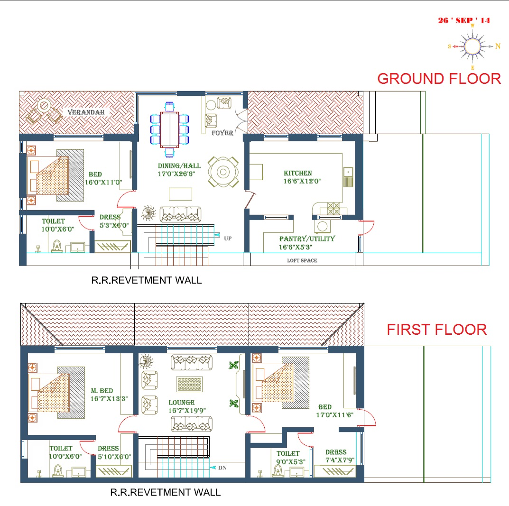
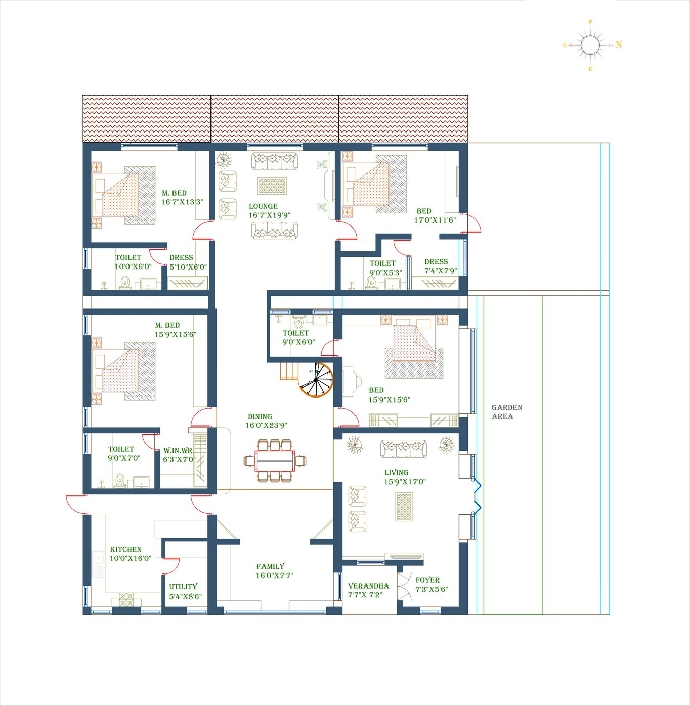

## PROJECT STREAMSIDE

The vision is ________

The project comprises of 5 acres within the 33 acre compound which earlier was used for an industrial estate

--- &custbg bg:"./assets/img/Site-view.jpg"

## PARTNERS

Streamside Ketti is a project undertaken by the Coonoor Tea Estate group and the Vitrag Group through a JV.

*** =left

- *Coonoor Tea Estate*

- Promoters

*** =right

- *Vitrag Group*

- Project management of Development
- Marketing

--- &custbg bg:"./assets/img/DilapidateBuilding.jpg"

## WHERE DID WE START?

--- &custbg bg:"./assets/img/DSC00510.jpg"

## WHERE WE ARE TODAY?

--- &custbg bg:"./assets/img/DilapidateBuildingb.jpg"

## WHERE DID WE START?

--- &custbg bg:"./assets/img/a2s1.jpg"

## WHERE WE ARE TODAY?

--- &custbg bg:"./assets/img/a1s2singlepic.jpg"

## DEVELOPMENTS SO FAR

>* Regularizing the land, titles and demarcating plots for sale
>* Using existing walls and pillars to renovate old sheds into *spacious*, *grand* homes
>* 2 are fully furnished and 2 larger units are underway
>* Giving the stream definition along the property

---  &custbg bg:"./assets/img/DSC00574.jpg"

## DEVELOPMENTS IN PROGRESS

>* Beautification of the compound with trees planted around driveway
>* Landscaping and retention along stream side
>* Civil and furnishing of the 2 x 3,600 sq.ft. large homes
>* Demolition of other dilipidated structures around the former factory

---  &custbg bg:"./assets/img/Unit1.jpg"

## UNIT 1

>* 2 Bedroom home of 2350 sq.ft.
>* Featured sun room with glass roof top
>* Large attic for recreation and storage
>* Walk out into a the terrace which enjoys views of the valley
>* Besides the attic, the home is old age friendly as it is on 1 level

---  &custbg bg:"./assets/img/Unit2.jpg"

## UNIT 2

>* 3 Bedroom unit
>* Double storey building with separate family room and dining room
>* All rooms enjoy the view of the meadows and hills beyond

---  &custbg bg:"./assets/img/Unit1.jpg"

## UNIT 3 & 4

>* 4060 sq.ft. homes with 4 bedrooms
>* Single storey with an attic to the balcony
>* Balcony facing the stream and the lawns near the club house
>* Also old age friendly as all the bedroom are on 1 level

---  &custbg bg:"./assets/img/Unit1.jpg"

>* *Floor Plan of Unit 1*

>* 

---  &custbg bg:"./assets/img/Unit2.jpg"

>* *Floor Plan of Unit 2*

>* 

---  &custbg bg:"./assets/img/Unit1.jpg"

>* *Floor Plan of Unit 3 and 4*

>* 

---  &custbg bg:"./assets/img/Phase2.jpg"

## PROPOSED DEVELOPMENT - PHASE 2

>* Phase 2 has been designed and implementation begins in Oct 2015
>* A total of 7 homes are slated to be built in the next 18 months
>* All homes with a walkout into the Central lawn and multipurpose
>* Cycling track around the layout
>* Separate walking track around the lawn
>* Balconies for all first floor bedrooms to enjoy the finest of Nilgiris

---  &custbg bg:"./assets/img/UnitA.jpg"

## PROPOSED - UNIT A
>* 3 Bedroom Unit of 1620 sq.ft.
>* 2 storey home with island kitchen
>* 2 lawns with space for a kitchen garden
>* Tall living room with electric fireplace

---  &custbg bg:"./assets/img/UnitB.jpg"

## PROPOSED - UNIT B

>* 3 Bedroom Unit with larger floor area of 1950 sq.ft.
>* 2 storey home with island kitchen
>* Lawns on 3 sides of the home and verandah spaces
>* Tall living room with electric fireplace and option to create an additional Pooja/cloak room
>* Commanding view of the entire lawn and the mountains beyond

---  &custbg bg:"./assets/img/UnitC.jpg"

## PROPOSED - UNIT C

>* Unique 3 bedroom home with larger floor area
>* 2 storey home with larger breakfast dining area]
>* Lawns on 3 sides of the home and verandah spaces
>* Tall living room with electric fireplace and option to create an additional Pooja/cloak room
>* Commanding view of the entire lawn and the mountains beyond

---  &custbg bg:"./assets/img/Central-court.jpg"

## FACILITIES

We have kept in mind the convenience for families. Young or old, the facilities we provide meet the need for all age groups.

### Water

>* 1,50,000 litre overhead water tank
>* Rain water harvesting storage
>* Stream alongside is perennial

### Roads
>* Fully tarred 23 feet road throughout the gated community
>* Street Lighting & domestic EB connections
>* Flat surface suitable for cycling

---  &custbg bg:"./assets/img/Central-Park.jpg"

## FACILITIES

### Park
>* 12,000 sq.ft of central lawn
>* Separate walking track around the lawn
>* Sit out area between park and multipurpose court

### Multipurpose Court
>* 80' x 40' multipurpose court with suitable flooring
>* Can cater to basketball, badminton and volleyball

---  &custbg bg:"./assets/img/Train-near-Streamside.jpg"

## LOCATION

>* 1 km from NH 67 connecting Coimbatore to Mysore at Yellanhalli
>* 8 kms drive to Ooty
>* 9 kms drive to Coonoor
>* Iconic Ketti station is within reach

---  &custbg bg:"./assets/img/GymkhanaClub.jpg"

## SURROUNDINGS

>* Provisions and restaurants are within 1 km at Yellanhalli
>* Tourists spots around Ooty, Coonoor and Kotagiri are within reach as Ketti is central
>* Accessible to 2 golf courses - 12 kms to Wellington Gymkhana Club and 14 kms to Ooty Gymkhana Club
>* Prominent Educational Institutions like the Laidlaw Memorial School and CSI Engineering college are within the Ketti Valley
>* The Lawrence School, Lovedale, is a 20 minute drive

---  &custbg bg:"./assets/img/Streamside-Terrace.jpg"
  
## APPROVALS

>* The property falls under the Panchayat zone and is suitable for residential purposes.
